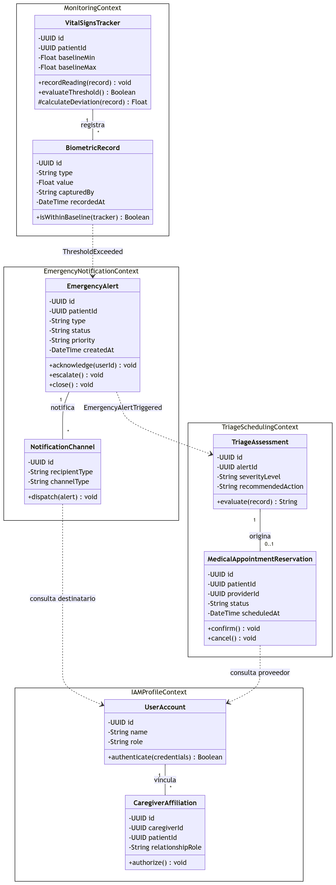

## 4.7. Software Object-Oriented Design

### 4.7.1. Class Diagrams

El diagrama de clases detalla, a nivel de implementación, los Aggregates definidos en el Design-Level Event Storming ([4.6.1](46-domain-driven-software-architecture.md)), agrupados por Bounded Context. Se elaboró como Diagram-as-Code con Mermaid. Cada clase incluye sus atributos y métodos con el scope correspondiente (`+` public, `-` private, `#` protected), y las relaciones indican nombre, dirección y multiplicidad. Las relaciones entre Bounded Contexts se representan como dependencias (línea punteada) etiquetadas con el Domain Event que las origina, en lugar de asociaciones directas, respetando el aislamiento entre contextos.

* **Monitoring Context:** `VitalSignsTracker` registra y evalúa la `BiometricRecord` capturada frente a la línea base del paciente.
* **Emergency & Notification Context:** una `BiometricRecord` fuera de rango origina (evento `ThresholdExceeded`) una `EmergencyAlert`, que notifica a través de `NotificationChannel`.
* **Triage & Scheduling Context:** la `EmergencyAlert` dispara (evento `EmergencyAlertTriggered`) una `TriageAssessment`, que puede originar una `MedicalAppointmentReservation`.
* **IAM & Profile Context:** `UserAccount` vincula `CaregiverAffiliation` para representar la red familiar autorizada; es consultado por los demás contextos para resolver destinatarios y proveedores.

