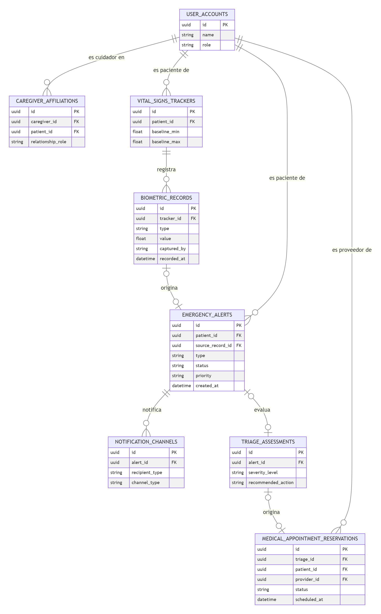

## 4.8. Database Design

### 4.8.1. Database Diagrams

El almacenamiento de VitaLink es relacional y deriva directamente de los Aggregates del diagrama de clases ([4.7.1](47-software-object-oriented-design.md)). Se elaboró como Diagram-as-Code con Mermaid, especificando tipo de dato, llave primaria (PK) y llaves foráneas (FK) por tabla.

* `user_accounts` centraliza a pacientes, cuidadores y proveedores en una sola tabla diferenciada por `role`, en lugar de una tabla por tipo de actor, siguiendo el Aggregate `UserAccount` de IAM & Profile Context.
* `caregiver_affiliations` es la tabla de unión entre un cuidador y un paciente (ambos referencian `user_accounts`), y guarda el rol de la relación (principal/secundario).
* `emergency_alerts.source_record_id` y `triage_assessments.alert_id` son FK nulas: una alerta puede no tener un registro biométrico de origen (ej. botón de auxilio manual), y no toda alerta deriva en una evaluación de triaje.
* `medical_appointment_reservations.triage_id` también es nula, dado que una cita puede confirmarse sin haber pasado por una evaluación de triaje previa. 

