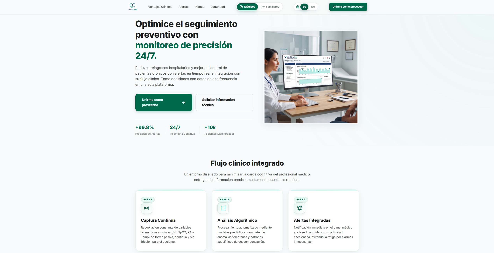

## 5.2. Landing Page, Services & Applications Implementation

### 5.2.1. Sprint 1

Durante el Sprint 1, el equipo CodeBrokers se enfocó en desarrollar la primera versión funcional de la Landing Page de VitaLink y su integración inicial con el frontend en Angular.

El objetivo principal fue comunicar la propuesta de valor del producto, mostrando cómo VitaLink permite realizar un monitoreo preventivo del adulto mayor mediante alertas inteligentes y facilitar la comunicación entre familiares y profesionales de salud.

Durante este Sprint se desarrollaron las primeras secciones visuales del producto, aplicando los criterios definidos durante la etapa de diseño UX/UI y preparando la primera versión desplegada de la Landing Page en un entorno público.

#### 5.2.1.1. Sprint Planning 1

Durante el Sprint Planning 1, el equipo definió como objetivo principal desarrollar y desplegar la primera versión funcional de la Landing Page de VitaLink. Para ello, se seleccionaron las User Stories US-01 a US-10 de la épica EP-01 Captación y Confianza, que suman **10 Story Points**, igual a la velocidad definida para el inicio del proyecto.

*Criterio de estimación.* Las historias de EP-01 son secciones estáticas de la Landing Page, de complejidad y riesgo similares y sin dependencias de backend. Por ello se estimaron de forma relativa con 1 Story Point cada una (aproximadamente 3 horas de trabajo por historia). Las cinco tareas habilitadoras T11 a T15 (diseño responsivo, revisión UX/UI, documentación, integración y despliegue) suman 14 horas adicionales y se ejecutan en apoyo del Sprint Goal. Esta estimación se refinó durante el Sprint Planning y se registra en el historial de versiones del informe.

\begingroup
\footnotesize
\begin{longtable}{|p{0.26\textwidth}|p{0.64\textwidth}|}
\caption{Sprint Planning 1}\\
\hline
\textbf{Sprint \#} & \textbf{Sprint 1} \\ \hline
\endhead
\textbf{Sprint Planning Background} & \\ \hline
\textbf{Date} & 2026-09-01 \\ \hline
\textbf{Time} & 7:00 PM \\ \hline
\textbf{Location} & Reunión virtual mediante Discord \\ \hline
\textbf{Prepared By} & Deiby Vargas \\ \hline
\textbf{Attendees (to planning meeting)} & Fernando Contreras, Pablo Martinez, Yazid Said, Kirk Quiliano, Deiby Vargas \\ \hline
\textbf{Sprint 0 Review Summary} & Al tratarse del primer Sprint del proyecto, no existe un Sprint anterior para realizar una revisión de resultados. El equipo inicia tomando como base los artefactos desarrollados durante Requirements Elicitation, Requirements Specification y Product Design. \\ \hline
\textbf{Sprint 0 Retrospective Summary} & Al no existir un Sprint previo, no se cuenta con una retrospectiva anterior. Como punto inicial, el equipo acordó utilizar GitFlow para el trabajo colaborativo, Trello para el seguimiento de tareas y GitHub para el control de versiones y la revisión de cambios. \\ \hline
\textbf{Sprint Goal \& User Stories} & \\ \hline
\textbf{Sprint 1 Goal} & Nuestro enfoque está en desarrollar y publicar una primera versión funcional, responsive y accesible de la Landing Page de VitaLink. Creemos que esto permitirá que profesionales de salud, familiares y adultos mayores comprendan la propuesta de valor del producto. Esto se confirmará cuando la Landing Page se encuentre desplegada públicamente e incluya las funcionalidades definidas en las User Stories US-01 a US-10 de la épica EP-01. \\ \hline
\textbf{Sprint 1 Velocity} & 10 Story Points \\ \hline
\textbf{Sum of Story Points} & 10 Story Points (US-01 a US-10) \\ \hline
\end{longtable}
\endgroup

#### 5.2.1.2. Aspect Leaders and Collaborators

Durante el Sprint 1 se definieron los principales aspectos del desarrollo de la primera versión funcional de la Landing Page de VitaLink. Para cada aspecto se asignó un integrante como **Leader (L)**, responsable principal de dirigir y supervisar su desarrollo, mientras que los demás participaron como **Collaborators (C)**.

\begingroup
\footnotesize
\setlength{\tabcolsep}{3pt}
\begin{longtable}{|p{0.15\textwidth}|p{0.13\textwidth}|p{0.13\textwidth}|p{0.14\textwidth}|p{0.11\textwidth}|p{0.12\textwidth}|p{0.13\textwidth}|}
\caption{Aspect Leaders and Collaborators del Sprint 1}\\
\hline
\textbf{Team Member} & \textbf{GitHub Username} & \textbf{Structure \& Hero} & \textbf{Benefits, Alerts \& Privacy} & \textbf{Responsive UI} & \textbf{Sprint Docs} & \textbf{Deployment \& Integration} \\ \hline
\endhead
Fernando Contreras & FernSkibidi69 & C & C & C & & C \\ \hline
Pablo Martinez & Delzekl & C & C & C & C & \\ \hline
Yazid Said & BL4Z3K4D & L & L & L & & C \\ \hline
Kirk Quiliano & Kirkcito & & C & & L & C \\ \hline
Deiby Vargas & poluxbinPe & C & & C & C & L \\ \hline
\end{longtable}
\endgroup

**L:** Leader | **C:** Collaborator

#### 5.2.1.3. Sprint Backlog 1

Las 15 tareas del Sprint 1 (T01 a T15) se encuentran en estado **Done**, completadas y desplegadas. Las tareas T01 a T10 desarrollan cada una la User Story indicada. Las tareas T11 a T15 son habilitadoras: apoyan de forma transversal a US-01 a US-10 y al Sprint Goal.

**Sprint Board:** Trello  
**URL pública:** <https://trello.com/b/uWEShiCR/sprint-codebrokers>

\begin{figure}[H]
\centering
\includegraphics[width=\linewidth,height=0.8\textheight,keepaspectratio]{assets/SprintBoard-Trello-Done.png}
\caption{Sprint Board 1 en Trello con las tareas T01 a T15 en estado Done}
\end{figure}

\begin{landscape}
\begingroup
\small
\setlength{\tabcolsep}{4pt}
\begin{longtable}{|p{0.05\textwidth}|p{0.05\textwidth}|p{0.16\textwidth}|p{0.045\textwidth}|p{0.12\textwidth}|p{0.27\textwidth}|p{0.05\textwidth}|p{0.07\textwidth}|p{0.05\textwidth}|}
\caption{Sprint Backlog 1}\\
\hline
\textbf{Sprint \#} & \textbf{Story Id} & \textbf{Story Title} & \textbf{Task Id} & \textbf{Task Title} & \textbf{Task Description} & \textbf{Est. (h)} & \textbf{Assigned To} & \textbf{Status} \\ \hline
\endfirsthead
\hline
\textbf{Sprint \#} & \textbf{Story Id} & \textbf{Story Title} & \textbf{Task Id} & \textbf{Task Title} & \textbf{Task Description} & \textbf{Est. (h)} & \textbf{Assigned To} & \textbf{Status} \\ \hline
\endhead

1 & US-01 & Entender la propuesta de valor en segundos & T01 & Implement Hero section & Implementar la sección inicial mostrando la propuesta de valor. & 3 & Yazid Said & \textbf{Done} \\ \hline
1 & US-02 & Confiar antes de registrar datos de pacientes & T02 & Implement security section & Contenido sobre cifrado y privacidad de datos. & 3 & Pablo Martinez & \textbf{Done} \\ \hline
1 & US-03 & Solicitar información antes de registrarse & T03 & Implement contact section & Formulario para solicitar información corporativa. & 3 & Fernando Contreras & \textbf{Done} \\ \hline
1 & US-04 & Unirme como proveedor de salud & T04 & Implement healthcare CTA & Call to Action para el registro clínico de proveedores. & 3 & Yazid Said & \textbf{Done} \\ \hline
1 & US-05 & Ver un ejemplo de cómo funciona una alerta & T05 & Implement alert example & Diseño visual simulado de una alerta y su paciente. & 3 & Pablo Martinez & \textbf{Done} \\ \hline
1 & US-06 & Entender el beneficio sin llamadas constantes & T06 & Implement family benefits & Sección sobre el monitoreo remoto automático. & 3 & Fernando Contreras & \textbf{Done} \\ \hline
1 & US-07 & Confiar en quién ve los datos de salud & T07 & Implement family privacy & Explicación de acceso por roles y visibilidad de los datos de salud. & 3 & Pablo Martinez & \textbf{Done} \\ \hline
1 & US-08 & Conocer cómo funciona antes de crear cuenta & T08 & Implement how-it-works & Sección explicativa de los pasos de captura de datos. & 3 & Yazid Said & \textbf{Done} \\ \hline
1 & US-09 & Entender la plataforma sin tecnicismos & T09 & Adapt content & Redacción de textos en lenguaje accesible. & 2 & Kirk Quiliano & \textbf{Done} \\ \hline
1 & US-10 & Ver qué esperar antes de registrarse & T10 & Implement dashboard preview & Imágenes previas de las interfaces familiares. & 3 & Yazid Said & \textbf{Done} \\ \hline
1 & US-01 a US-10 (transversal) & Habilitadora & T11 & Responsive design & CSS y Media Queries para dispositivos móviles. & 4 & Fernando Contreras & \textbf{Done} \\ \hline
1 & US-01 a US-10 (transversal) & Habilitadora & T12 & Review UX/UI consistency & Verificación WCAG y coherencia con Figma. & 3 & Pablo Martinez & \textbf{Done} \\ \hline
1 & Sprint Goal & Habilitadora & T13 & Review Sprint docs & Actualización del reporte en Markdown. & 2 & Kirk Quiliano & \textbf{Done} \\ \hline
1 & US-01 a US-10 (transversal) & Habilitadora & T14 & Integrate Landing & Resolución de conflictos de merge en Git e integración de ramas. & 3 & Deiby Vargas & \textbf{Done} \\ \hline
1 & Sprint Goal & Habilitadora & T15 & Deploy Landing Page & Configuración de GitHub Pages y Actions. & 2 & Deiby Vargas & \textbf{Done} \\ \hline

\end{longtable}
\endgroup
\end{landscape}

#### 5.2.1.4. Development Evidence for Sprint Review

La siguiente matriz documenta la cadena completa de ejecución del Sprint con una fila por tarea: integrante, rama (GitFlow), commit y Pull Request, tarea, User Story y resultado.

**Ruta de trazabilidad:** Integrante $\rightarrow$ Branch $\rightarrow$ Commit / Pull Request $\rightarrow$ Task / US $\rightarrow$ Resultado.

\begin{landscape}
\begingroup
\small
\setlength{\tabcolsep}{4pt}
\begin{longtable}{|p{0.11\textwidth}|p{0.16\textwidth}|p{0.14\textwidth}|p{0.07\textwidth}|p{0.09\textwidth}|p{0.30\textwidth}|}
\caption{Matriz de trazabilidad del Sprint 1: integrante, rama, commit/PR, tarea, historia y resultado}\\
\hline
\textbf{Integrante} & \textbf{Branch (GitFlow)} & \textbf{Commit / PR} & \textbf{Task} & \textbf{US} & \textbf{Resultado} \\ \hline
\endfirsthead
\hline
\textbf{Integrante} & \textbf{Branch (GitFlow)} & \textbf{Commit / PR} & \textbf{Task} & \textbf{US} & \textbf{Resultado} \\ \hline
\endhead

Yazid Said & \texttt{develop} & PR \#6 / \texttt{91ffa24} & T01 & US-01 & Integración de componentes y propuesta de valor en la rama develop. \\ \hline
Yazid Said & \texttt{feature/footer} & PR \#5 / \texttt{abf9be7} & T08 & US-08 & Estructura del footer, enlaces informativos y cómo funciona. \\ \hline
Yazid Said & \texttt{chore/logo} & Commit \texttt{389e581} & T04 & US-04 & Adición del logotipo oficial y assets base del CTA institucional. \\ \hline
Pablo Martinez & \texttt{feat/navbar-hero} & PR \#1 / \texttt{db20de2} & T02 \newline T05 & US-02 \newline US-05 & Barra de navegación, Hero section y estructura base de seguridad y alertas. \\ \hline
Pablo Martinez & \texttt{feat/navbar-hero} & Commit \texttt{d55fc4a} & T07 \newline T12 & US-07 \newline - & Navegación a secciones de privacidad, consistencia UX/UI y accesibilidad. \\ \hline
Fernando Contreras & \texttt{feat/pricing} & Commit \texttt{baae70f} & T03 \newline T06 & US-03 \newline US-06 & Secciones institucionales, pricing tiers, testimonios y beneficios familiares. \\ \hline
Fernando Contreras & \texttt{feat/pricing} & Commit \texttt{bcbcc2d} & T11 & - & Ajustes CSS, testimonios y Media Queries para dispositivos móviles. \\ \hline
Kirk Quiliano & \texttt{docs/report} & Commit \texttt{15b22e8} & T09 \newline T13 & US-09 \newline - & Textos revisados en lenguaje accesible y actualización del repositorio del informe. \\ \hline
Deiby Vargas & \texttt{main} & PR \#32 / \texttt{f2d7652} & T14 \newline T15 & - & Orquestación de ramas, resolución de conflictos en Git y despliegue final. \\ \hline

\end{longtable}
\endgroup
\end{landscape}

Los Pull Requests y commits citados pueden verificarse en el repositorio de la organización. Los mensajes de commit siguen la convención Conventional Commits e incluyen trazabilidad directa hacia la funcionalidad implementada: **[GitHub-Url](https://github.com/CodeBrokers-VitaLink/upc-pre-202620-1asi0729-7737-CodeBrokers-Report)** (sección *Pull requests*, filtro *Merged*). Los mensajes de commit siguen la convención Conventional Commits e incluyen el identificador de la User Story cuando aplica.

#### 5.2.1.5. Execution Evidence for Sprint Review

La ejecución del Sprint fue validada mediante la revisión funcional de la Landing Page implementada.

Las principales funcionalidades verificadas fueron:

- Visualización correcta de la propuesta de valor de VitaLink.
- Presentación de beneficios para familiares y profesionales de salud.
- Visualización de la sección de alertas automáticas.
- Correcto funcionamiento en dispositivos móviles.
- Navegación entre las diferentes secciones.

Imagenes del landing page:

**Medicos**

-Incios:

Descripción:

Pagos:

- Seguridad:

- Soporte:

**Familiares**

- Incio:

  

- Descripción:

  

- Objetivos:

  

- Planes:

  

- Soporte:

  

#### 5.2.1.6. Services Documentation Evidence for Sprint Review

Durante el Sprint 1 no se implementaron RESTful Web Services debido a que el alcance estuvo enfocado en la construcción inicial de la Landing Page.

La documentación de endpoints, Swagger/OpenAPI y pruebas mediante Postman será desarrollada en los siguientes Sprints cuando se implemente la capa backend de VitaLink.

#### 5.2.1.7. Software Deployment Evidence for Sprint Review

Durante el Sprint 1 se realizó el despliegue de la primera versión funcional de la Landing Page de VitaLink. El objetivo de esta actividad fue publicar el sitio web en un entorno accesible públicamente, permitiendo validar su funcionamiento fuera del entorno local de desarrollo.

Para el despliegue se utilizará **GitHub Pages**, aprovechando su integración directa con el repositorio de la Landing Page y su capacidad para publicar sitios web estáticos desarrollados con HTML, CSS y JavaScript.

#### Proceso de despliegue

El proceso de despliegue de la Landing Page se realizará mediante los siguientes pasos:

1. Crear el repositorio correspondiente a la Landing Page de VitaLink dentro de GitHub.

2. Subir e integrar en la rama principal los archivos HTML, CSS, JavaScript y recursos estáticos necesarios para el funcionamiento del sitio.

3. Ingresar a la configuración del repositorio mediante la opción `Settings`.

4. Acceder a la sección `Pages` dentro de la configuración del repositorio.

5. Configurar el origen del despliegue seleccionando la rama `main` y la carpeta raíz `/`.

6. Guardar la configuración para iniciar el proceso de publicación mediante GitHub Pages.

7. Esperar a que GitHub complete el proceso de despliegue y genere la URL pública correspondiente.

8. Acceder a la URL generada y verificar que la Landing Page se visualice correctamente y que sus principales secciones funcionen según lo esperado.

#### 5.2.1.8. Team Collaboration Insights during Sprint

Durante el Sprint 1, el equipo trabajó de manera colaborativa utilizando GitHub como plataforma principal para el control de versiones y seguimiento de los aportes realizados durante el desarrollo de la Landing Page de VitaLink.

Cada integrante participó en las actividades asignadas mediante ramas independientes creadas a partir de la rama `develop`. Las funcionalidades desarrolladas fueron posteriormente integradas mediante Pull Requests, permitiendo revisar los cambios antes de incorporarlos al proyecto.

Los integrantes y sus respectivos usuarios de GitHub son:

| Team Member | GitHub Username |
|---|---|
| Fernando Contreras | FernSkibidi69 |
| Pablo Martinez | Delzekl |
| Yazid Said | BL4Z3K4D |
| Kirk Quiliano | Kirkcito |
| Deiby Vargas | poluxbinPe |

Durante el Sprint se utilizó una estrategia basada en GitFlow, manteniendo la rama `develop` como rama de integración y utilizando ramas `feature/*` para las funcionalidades desarrolladas.

Asimismo, los commits realizados durante la implementación siguieron la convención Conventional Commits, facilitando la identificación de cambios relacionados con nuevas funcionalidades, correcciones, documentación y estilos.

La colaboración del equipo será evidenciada mediante las estadísticas y registros disponibles en GitHub.

Link de commits del repositorio del reporte: [https://github.com/CodeBrokers-VitaLink/upc-pre-202620-1asi0729-7737-CodeBrokers-Report/compare/main...develop]

Link de commits del repositorio del landing page: [https://github.com/CodeBrokers-VitaLink/upc-pre-202620-1asi0729-7737-CodeBrokers-Landin_Page/compare/main...develop]

Durante el desarrollo del proyecto VitaLink, todos los integrantes del equipo participaron activamente en las diferentes actividades correspondientes al ciclo de desarrollo del producto.

Las contribuciones del equipo no se limitan únicamente a los commits visibles en la sección de Contributors de GitHub, ya que algunos aportes fueron realizados mediante la organización de tareas, revisión de documentación, planificación de Sprints, diseño UX/UI, validación de entregables y coordinación del desarrollo.

Report:

Landing page:

### 5.2.2. Sprint 2

Durante el Sprint 2, el equipo se enfocó en desarrollar y desplegar la primera versión de la **Frontend Web Application de VitaLink utilizando Angular**.

El alcance estuvo orientado a implementar interfaces destinadas a profesionales de salud y familiares/adultos mayores, permitiendo visualizar alertas, identificar su nivel de urgencia, acceder al detalle de pacientes, visualizar información clínica y realizar acciones básicas ante una alerta.

Asimismo, durante este Sprint se continuó trabajando sobre la Landing Page desarrollada previamente y se realizó el despliegue público de la Frontend Web Application.

| Sprint # | Sprint 2 |
|---|---|
| **Sprint Planning Background** | |
| **Date** | 2026-09-15 |
| **Time** | 7:00 PM |
| **Location** | Reunión virtual mediante Discord |
| **Prepared By** | Yazid Said |
| **Attendees (to planning meeting)** | Fernando Contreras, Pablo Martinez, Yazid Said, Kirk Quiliano, Deiby Vargas |
| **Sprint 1 Review Summary** | Durante el Sprint 1 se desarrolló la primera versión de la Landing Page de VitaLink, incluyendo las secciones asociadas a la épica EP-01 Captación y Confianza. Asimismo, se realizó su despliegue inicial y se estableció el flujo de trabajo mediante GitHub y Git Flow. |
| **Sprint 1 Retrospective Summary** | El equipo identificó la necesidad de mantener una distribución clara de tareas, realizar integraciones progresivas mediante Pull Requests y verificar continuamente la consistencia entre los diseños UX/UI y la implementación. Para el Sprint 2 se priorizará una mejor coordinación entre diseño, desarrollo e integración. |
| **Sprint Goal & User Stories** | |
| **Sprint 2 Goal** | Nuestro enfoque está en desarrollar y publicar la primera versión funcional de la Frontend Web Application de VitaLink. Creemos que esto permitirá que profesionales de salud, familiares y adultos mayores puedan visualizar información relevante sobre el estado de salud y las alertas de una manera simple y comprensible. Esto se confirmará cuando las principales interfaces correspondientes a las User Stories seleccionadas puedan ejecutarse correctamente desde la aplicación web desplegada. |
| **Sprint 2 Velocity** | 18 Story Points |
| **Sum of Story Points** | 18 Story Points |

#### 5.2.2.2. Aspect Leaders and Collaborators

Durante el Sprint 2 se identificaron los principales aspectos relacionados con el desarrollo de la primera versión de la Frontend Web Application.

Cada aspecto cuenta con un **Leader (L)**, responsable de orientar su desarrollo, y **Collaborators (C)**, quienes apoyarán las actividades correspondientes.

| Team Member | GitHub Username | Medical Frontend | Family Frontend | UX/UI & Accessibility | Sprint Documentation | Integration & Deployment |
|---|---|---|---|---|---|---|
| Fernando Contreras | FernSkibidi69 | C | L | C |  | C |
| Pablo Martinez | Delzekl | C | C | L | C |  |
| Yazid Said | BL4Z3K4D | L | C | C | C | C |
| Kirk Quiliano | Kirkcito |  | C |  | L | C |
| Deiby Vargas | poluxbinPe | C | C | C | C | L |

**L:** Leader  
**C:** Collaborator

La distribución planteada permitió relacionar los aspectos del Sprint con las tareas seleccionadas en el Sprint Backlog. Yazid Said lideró principalmente las interfaces dirigidas a profesionales de salud, Fernando Contreras las interfaces dirigidas a familiares y adultos mayores, Pablo Martinez la consistencia UX/UI y accesibilidad, Kirk Quiliano la documentación y Deiby Vargas la integración y despliegue.

#### 5.2.2.3. Sprint Backlog 2

Durante el Sprint 2, el equipo se enfocará en implementar las principales interfaces de la primera versión de la Frontend Web Application de VitaLink.

Las User Stories seleccionadas permitirán desarrollar vistas iniciales para profesionales de salud, familiares y adultos mayores. Para la gestión de las actividades se utilizará **Trello**, donde cada Work-item/Task será organizado de acuerdo con su estado de avance.

**Sprint Board:** Trello

[**URL del Sprint Board:**](https://trello.com/invite/b/6ac828aceaa0c53fc0e4235d/ATTI73a3e020cdfa31f843e5d02719051bfd102F8A9B/sprint-2)

 

| Sprint # | Story Id | Story Title | Task Id | Task Title | Task Description | Estimation (Hours) | Assigned To | Status |
|---|---|---|---|---|---|---:|---|---|
| Sprint 2 | US-11 | Resumen inicial de alertas pendientes | T11 | Implement medical alert dashboard | Desarrollar el panel principal del médico mostrando la cantidad de alertas pendientes agrupadas según su nivel de urgencia. | 5 | Yazid Said | To-do |
| Sprint 2 | US-12 | Nivel de urgencia diferenciado | T12 | Implement urgency indicators | Implementar elementos visuales que permitan distinguir rápidamente el nivel de urgencia de cada alerta sin abrir su detalle. | 3 | Pablo Martinez | To-do |
| Sprint 2 | US-13 | Acceder al detalle de un paciente | T13 | Implement patient detail view | Desarrollar la vista que permita acceder al detalle del paciente directamente desde una alerta seleccionada. | 5 | Yazid Said | To-do |
| Sprint 2 | US-18 | Estado general al abrir la app | T14 | Implement family status dashboard | Desarrollar la pantalla principal para familiares y adultos mayores mostrando un indicador simple del estado general. | 5 | Fernando Contreras | To-do |
| Sprint 2 | US-19 | Recibir una alerta comprensible | T15 | Implement family alert view | Implementar una alerta que presente de forma clara qué ocurrió, su gravedad y el estado actual de atención. | 4 | Fernando Contreras | To-do |
| Sprint 2 | US-20 | Confirmar atención con una acción simple | T16 | Implement alert confirmation | Implementar una acción sencilla que permita confirmar la atención de una alerta y reflejar visualmente su nuevo estado. | 3 | Deiby Vargas | To-do |
| Sprint 2 | US-25 | Modo de uso extremadamente simple | T17 | Simplify primary interactions | Adaptar las principales interacciones de la aplicación para que puedan completarse utilizando un máximo de dos pasos. | 4 | Pablo Martinez | To-do |

**Sprint Velocity:** 18 Story Points

**Sum of Story Points:** 18 Story Points

#### 5.2.2.4. Development Evidence for Sprint Review

Durante el Sprint 2 se implementó la primera versión funcional de la **Frontend Web Application de VitaLink utilizando Angular, TypeScript, HTML y CSS**.

El desarrollo fue organizado mediante ramas independientes e integración progresiva utilizando Pull Requests. Las funcionalidades implementadas abarcaron autenticación y control de roles, modelos y servicios asociados al cuidado del paciente, gestión del estado de la aplicación, interfaces de atención y componentes relacionados con pacientes y alertas.

**Repositorio de la Frontend Web Application:**

https://github.com/CodeBrokers-VitaLink/upc-pre-202620-1asi0729-7737-CodeBrokers-Frontend

**Historial de commits:**

| Repository | Branch | Commit Id | Commit Message  | Committed on |
|---|---|---|---|---|
| vitalink-frontend | main | 7301ab42b3b14be1a0910009cf5eb0fad4cc04e1 | first commit | 07/10/2026 |
| vitalink-frontend | feature/base-shared | b18ed75a4618864607c8279aee40b67c966e6ae3 | chore(base): actualizar configuracion y traducciones.  | 07/10/2026 |
| vitalink-frontend | feature/auth-user-management | d2fc8b01a79bd6ecade92cb8d14b3546d95bce82| feat: implement user authentication, role guards and profile management| 08/10/2026 |
| vitalink-frontend | feature/patient-care-services | 1f747baf1b61b1c36c6b77444989ead57d87bd12 | feat: add patient care models, data mappers and care services| 08/10/2026 |
| vitalink-frontend | feature/care-workspace | 520e605cb790ddd86203d722a56507864f92d248 | feat: implement care workspace and patient care state management| 08/10/2026 |
| vitalink-frontend | feature/patient-alert-components | ec7a0249330bf3b721cb18dbf659cbf44fa279d7 | feature(upload)/patient-alert-components| 08/10/2026 |
| vitalink-frontend | main| a51b67c1d15cbf34c73d83d85e6c1c73675c4b20 | Merge pull request #5 from CodeBrokers-VitaLink/develop| 08/10/2026 |

#### 5.2.2.5. Execution Evidence for Sprint Review

Durante el Sprint 2 se validó la ejecución de las principales interfaces implementadas en la primera versión de la Frontend Web Application de VitaLink.

La aplicación permite diferenciar la experiencia según el rol del usuario, proporcionando interfaces específicas para profesionales de salud y familiares.

##### Vista para profesionales de salud

La interfaz médica permite visualizar el resumen de alertas y pacientes, diferenciar el nivel de prioridad de las alertas, aplicar filtros, consultar pacientes asignados y acceder al detalle e historial correspondiente.

##### Vista para familiares

La interfaz para familiares permite seleccionar al adulto mayor asociado, visualizar su estado general, consultar mediciones registradas, identificar alertas abiertas y acceder a información relacionada con su cuidado.

**Pagina de login**

**Dashboard de usuario y familiar/adulto mayor**

**Vista de familia/adulto mayor con alertas pendientes y nivel de urgencia diferenciado*

**Vista del perfil del usuario familiar/adulto mayor**

**Dashboard de usuario profesional de salud**

**Vista de profesional de salud con alertas pendientes y nivel de urgencia diferenciado**

**Vista del perfil del usuario profesional de salud** 

##### Gestión de alertas

La aplicación permite consultar información de las alertas, visualizar su estado y realizar acciones relacionadas con su atención según el rol correspondiente.

**Frontend Web Application desplegada:**

https://vitalink-frontend.vercel.app/

#### 5.2.2.6. Services Documentation Evidence for Sprint Review

Durante el Sprint 2 no se implementaron todavía los **RESTful Web Services definitivos de VitaLink mediante Java y Spring Boot**.

El alcance del Sprint estuvo enfocado principalmente en la implementación y despliegue de la primera versión de la Frontend Web Application.

Para validar los diferentes flujos de la aplicación, el frontend consume una API de demostración configurada mediante `environment.apiUrl`. Esta API permite utilizar información temporal para representar pacientes, alertas, mediciones e intervenciones.

#### 5.2.2.7. Software Deployment Evidence for Sprint Review

Durante el Sprint 2 se realizó el despliegue de la primera versión funcional de la Frontend Web Application de VitaLink, permitiendo acceder públicamente a las interfaces desarrolladas durante el Sprint.

##### Landing Page

La Landing Page continúa disponible públicamente mediante GitHub Pages.

**Repositorio:**

https://github.com/CodeBrokers-VitaLink/upc-pre-202620-1asi0729-7737-CodeBrokers-Landin_Page

**URL desplegada:**

https://codebrokers-vitalink.github.io/upc-pre-202620-1asi0729-7737-CodeBrokers-Landin_Page/

##### Frontend Web Application

La primera versión de la Frontend Web Application fue desarrollada utilizando Angular y desplegada mediante **Vercel**.

El proceso general de despliegue comprendió:

1. Desarrollo de funcionalidades mediante ramas independientes.
2. Integración y revisión de cambios mediante Pull Requests.
3. Integración de las funcionalidades desarrolladas.
4. Generación de la versión de producción de la aplicación Angular.
5. Despliegue de la aplicación mediante Vercel.
6. Validación del funcionamiento desde la URL pública.

**Repositorio de Frontend Web Application:**

https://github.com/CodeBrokers-VitaLink/upc-pre-202620-1asi0729-7737-CodeBrokers-Frontend

**URL desplegada:**

https://vitalink-frontend.vercel.app/

##### Evidencias

#### 5.2.2.8. Team Collaboration Insights during Sprint

Durante el Sprint 2, los integrantes colaborarán en el desarrollo de la primera versión de la Frontend Web Application utilizando GitHub como plataforma de control de versiones y colaboración.

Los integrantes y sus usuarios de GitHub son:

| Team Member | GitHub Username |
|---|---|
| Fernando Contreras | FernSkibidi69 |
| Pablo Martinez | Delzekl |
| Yazid Said | BL4Z3K4D |
| Kirk Quiliano | Kirkcito |
| Deiby Vargas | poluxbinPe |

Las funcionalidades serán implementadas mediante ramas feature y posteriormente integradas hacia `develop` mediante Pull Requests.

Las evidencias de colaboración correspondientes al Sprint 2 incluirán:

Estas evidencias permitirán identificar los aportes realizados por cada integrante y mantener trazabilidad sobre el trabajo colaborativo desarrollado durante el Sprint 2.
